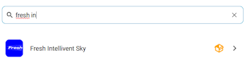
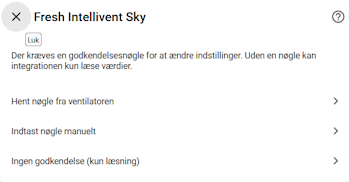

# Fresh Intellivent Sky/Ice for Home Assistant

A standalone Home Assistant integration for **Fresh Intellivent SKY** and **Intellivent ICE** bathroom fans using Bluetooth Low Energy.

This integration combines the Home Assistant integration from `freshintelliventHacs` with the BLE communication code from `pyfreshintellivent`. The combined codebase no longer depends on the external Python library and has been extensively expanded with additional controls, diagnostics, firmware handling, connection management, and multi-device settings duplication.

> [!NOTE]
> This is an unofficial community integration and is not affiliated with or supported by Fresh AB.

## Features

- Native Home Assistant Bluetooth discovery
- Support for Fresh Intellivent SKY and Intellivent ICE
- Authentication key setup through the Home Assistant UI
- Read-only installation without an authentication key
- Configurable polling interval
- Optional persistent BLE connection for faster updates
- Automatic reconnect and retry when a persistent connection fails
- Support for different firmware generations
- Batched setting writes with readback
- Boost and Pause controls with local countdown sensors
- Home Assistant-managed Night Mode and Silent Hours
- Scheduled maximum RPM limits with automatic restoration of normal settings
- Copy settings between two supported devices
- Estimated airflow in m³/h based on fan speed and installation configuration
- Per-device diagnostic debug logging
- Danish, Swedish and English translations

## Requirements

- Home Assistant 2026.1.0 or newer
- Bluetooth access from Home Assistant or a compatible Bluetooth proxy
- A Fresh Intellivent SKY or Intellivent ICE fan

## Available entities

The entities available depend on the firmware version and whether the integration was configured with an authentication key.

### Sensors

| Entity | Description |
| --- | --- |
| Temperature | Current temperature reported by the fan |
| Current speed | Current fan speed in RPM |
| Estimated airflow | Estimated airflow in m³/h based on the current fan speed and the configured duct size and front type |
| Mode | Current operating mode |
| Boost remaining time | Local countdown for an active Boost |
| Pause remaining time | Local countdown for an active Pause |
| Error | Error value reported by the fan as text |

### Estimated airflow

The **Estimated airflow** sensor shows the approximate current airflow in **m³/h**.

The value is calculated from the fan's current RPM using Fresh's airflow/performance data for the selected installation:

- Duct size: **Ø100 mm** or **Ø125 mm**
- Front type: **Standard** or **Design**

For example, a value of **75 m³/h** means that the fan is estimated to move approximately 75 cubic metres of air per hour at its current speed and installation configuration.

The airflow value is an estimate based on the fan's performance data and is **not a direct airflow measurement from the fan**.

### Diagnostic entities

Additional diagnostic entities provide information about the fan, raw sensor data, and its current Bluetooth connection:

| Entity | Description |
| --- | --- |
| Bluetooth Source | Bluetooth adapter or proxy currently used to communicate with the fan |
| RSSI | Current Bluetooth signal strength in dBm |
| Debug logs | Enable detailed diagnostic logging for the device |
| Error | Raw error value reported by the fan |
| Firmware Version | Firmware version reported by the fan |
| Connection Status | Current BLE connection state: Disconnected, Connecting or Connected |
| Humidity Sensor Raw | Raw humidity sensor value |
| Hardware Version | Hardware version reported by the fan |
| Light Sensor Raw | Raw light sensor value |
| Minimum Active | Raw minimum-active value reported by the fan |
| Reference Raw | Raw reference value reported by the fan |
| Raw State | Raw operating state value reported by the fan |
| Last Update | Date and time of the last successful update |
| VOC Sensor Raw | Raw VOC sensor value |

### Settings and controls

| Function | Available controls |
| --- | --- |
| Constant speed | Enable/disable and RPM |
| Humidity control | Enable/disable, sensitivity and RPM |
| Air quality/VOC control | Enable/disable, sensitivity and RPM where supported |
| Light control | Enable/disable, sensitivity, RPM and after-run time |
| Airing | Enable/disable, duration and RPM |
| External input | Delay time |
| Boost | Start, cancel, duration and RPM |
| Pause | Start, cancel and duration |
| Night Mode | Enable/disable, start time, end time and maximum RPM |
| Silent Hours | Enable/disable, start time, end time and maximum RPM |
| Airflow configuration | Duct size (Ø100/Ø125) and front type (Standard/Design) |
| Integration | Poll interval, Keep Connection |
| Device settings | Copy settings between configured devices |

## Firmware support

The integration reads the hardware and firmware versions directly from the fan and adjusts the available entities automatically.

- Newer firmware exposes a separate VOC RPM setting.
- Older firmware uses a combined humidity and air-quality RPM setting.
- Settings duplication translates the VOC RPM appropriately when copying between different supported firmware generations.

## Authentication modes

During setup, Home Assistant offers three authentication options:

- **Fetch key from fan** — place the fan in pairing mode and let the integration read the key.
- **Enter key manually** — enter an existing eight-character authentication key.
- **No authentication (read-only)** — expose sensor values without settings or action controls.

To place the fan in pairing mode, press and hold the power and Wi-Fi buttons for approximately eight seconds until the fan starts flashing. Then select the option to fetch the key.

## Migrating from freshintelliventHacs

> [!WARNING]
> If you already have [freshintelliventHacs](https://github.com/angoyd/freshintelliventHacs) installed, remove it before installing this integration.
>
> Both integrations use the same Home Assistant domain and the same folder: `custom_components/fresh_intellivent_sky`. Installing them at the same time can result in mixed or outdated files.

To migrate safely:

1. Remove the old **Fresh Intellivent Sky** integration from **Settings → Devices & services**.
2. Remove `freshintelliventHacs` from HACS.
3. Confirm that `custom_components/fresh_intellivent_sky` has been removed. If the folder remains, remove it manually.
4. Restart Home Assistant.
5. Install this integration using the instructions below.
6. Restart Home Assistant again.
7. Add **Fresh Intellivent Sky** from **Settings → Devices & services**.

## Installation

### Manual install via HACS

1. Open HACS in your Home Assistant instance.
2. Click the three dots (⋮) in the top-right corner.
3. Select **Custom repositories**.
4. Add the repository:
   - **URL:** `https://github.com/Spit68/Fresh-Intellivent-Sky`
   - **Category:** Integration
5. Click **Add**.
6. Find **Fresh Intellivent Sky** in HACS and install it.
7. Restart Home Assistant.

## Adding the integration

### Step 1: Go to Settings → Devices & services

### Step 2: Click + ADD INTEGRATION

### Step 3: Search for "Fresh Intellivent Sky"

### Step 4: Complete the configuration

Select the detected fan and choose how the authentication key should be configured.

## Polling and Keep Connection

The normal polling interval can be configured from the device settings.

When **Keep Connection** is disabled, the integration connects to the fan when required and disconnects after polling, writing, and reading settings.

When **Keep Connection** is enabled, the BLE connection is kept open and live values are refreshed every second. Persistent mode can provide faster updates, but it may use more Bluetooth resources.

## Night Mode and Silent Hours

Night Mode and Silent Hours provide scheduled RPM limits managed entirely by Home Assistant. Each mode can be enabled and configured separately for every device with a start time, end time, and maximum RPM.

When a scheduled mode starts, the integration saves the fan's normal RPM settings and temporarily limits settings that are higher than the configured maximum. Settings already below the limit remain unchanged and are never increased.

For example, with a maximum of `1200 RPM`:

- A normal setting of `850 RPM` remains at `850 RPM`.
- A normal setting of `1100 RPM` remains at `1100 RPM`.
- A normal setting of `1800 RPM` is temporarily limited to `1200 RPM`.

When the scheduled mode ends, the original RPM settings are restored automatically.

The two schedules may overlap. While both are active, the lowest configured maximum RPM is used. The original settings are restored only after the last active schedule has ended.

Schedules, enabled states, RPM limits, and saved normal RPM values are stored by Home Assistant and survive integration reloads and Home Assistant restarts. Time ranges that pass midnight, such as `22:00–07:00`, are supported.

> [!IMPORTANT]
> Night Mode and Silent Hours are integration features and are not stored in the fan itself. Home Assistant must be running and able to reach the fan through Bluetooth when settings need to be changed. If Home Assistant was unavailable at a scheduled transition, the integration evaluates the current schedule and applies or restores the appropriate settings when it starts again.

Manually changing an RPM setting while a scheduled mode is active overrides that setting. When the final active schedule ends, the RPM values saved before the scheduled period are restored.

## Copy settings between devices

When two or more supported devices are configured, the integration provides:

- **Copy From Device**
- **Copy To Device**
- **Duplicate Settings**

Select two different devices and press **Duplicate Settings** on the destination device. Supported fan settings are written to the destination and read back for verification. Home Assistant-only values such as the polling interval and the configured Boost and Pause values are copied as well.

## Diagnostic logging

Each device has a disabled-by-default **Debug logs** switch in the Diagnostic section.

When enabled, the integration logs detailed information for that device, including:

- Hardware and firmware versions
- BLE address
- RSSI and Bluetooth source when available
- Raw BLE status payload
- Flags, active trigger and motor speed
- Raw humidity, VOC and light values
- Fan speed, reference and minimum-active values
- Temperature and error value

Debug logging can generate a large number of log entries, especially when Keep Connection is enabled. Disable it again after troubleshooting.

## Troubleshooting

### The fan is not discovered

- Confirm that Bluetooth is available to Home Assistant.
- Move the fan or a Bluetooth proxy closer to Home Assistant.
- Confirm that the fan is powered on and not already connected to another Bluetooth client.
- Reload the integration or restart Home Assistant and try again.

### Settings cannot be changed

Settings and action controls require a valid authentication key. An installation configured with **No authentication** is intentionally read-only.

### A value briefly returns to its previous state

Rapidly changing a setting and then enabling its function can result in two separate BLE writes. Home Assistant may briefly display the intermediate state before the second write is completed.

### Diagnostic entities are still visible

Disabled-by-default diagnostic entities remain visible in the entity registry so users can enable them when needed. Home Assistant also preserves previous entity enable/disable choices by unique ID.

## Credits

This integration combines and builds upon two original open-source projects:

- [freshintelliventHacs](https://github.com/angoyd/freshintelliventHacs) by [@angoyd](https://github.com/angoyd)
- [pyfreshintellivent](https://github.com/LaStrada/pyfreshintellivent) by [@LaStrada](https://github.com/LaStrada)

The two projects have been merged into a standalone Home Assistant integration and extensively expanded by [@Spit68](https://github.com/Spit68).

## Issues and contributions

Bug reports and contributions are welcome through the repository's [issue tracker](https://github.com/Spit68/Fresh-Intellivent-Sky/issues).

When reporting a BLE or parsing problem, include the Home Assistant version, the fan hardware/software versions, and relevant logs. Enable **Debug logs** only for the affected device and remove any information you do not want to share before posting.
